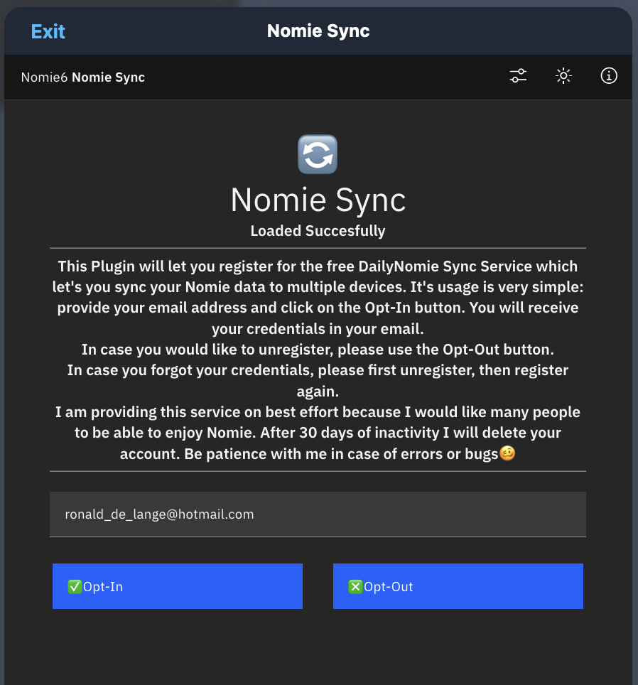
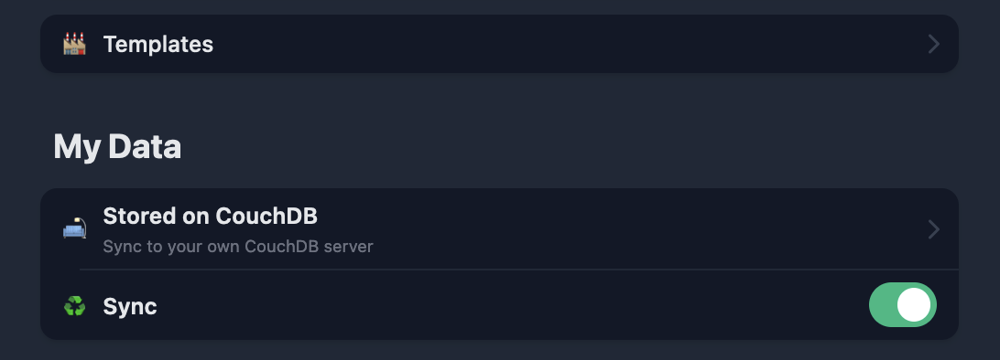
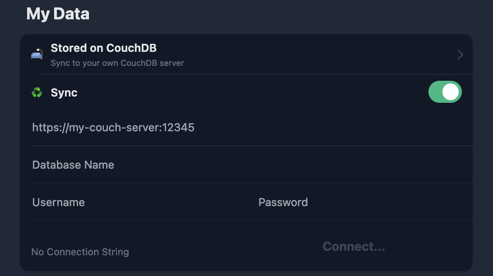

# 🔄Nomie Sync Plugin

The 🔄Nomie Sync Plugin is a plugin for Nomie6-oss.

## About the 🔄Nomie Sync Plugin

The Nomie Sync Plugin will enable you to register with the DailyNomie Sync Server. This Sync Server (a hosted CouchDB) will let you sync your Nomie Data between devices.

## Installing the Plugin

The url of the plugin is:

[https://dailynomie.github.io/nomie-plugin-couchdb/](https://dailynomie.github.io/nomie-plugin-couchdb/)

The 🔄Nomie Sync Plugin can be installed in Nomie via the following steps:

* Go to the More Tab
* Select Plugins
* Click the + or Add Custom Plugin
* Provide the url for the plugin
* Tap Install Plugin

## Using the Plugin

After launching the plugin, you will be presented with the main screen. This screen will simply enable you to register or un-register with the sync service.

### Register

In order to register, please make sure to provide a valid email address and click on the ✅Opt-In button. You will be presented with a confirmation if the registration was successfull. The details of your subscription are send to your email address.

### Un-Register

By clicking on the ❎Opt-Out button your subscription will be cancelled. Make sure to provide the email address which you used to subscribe.

### Forgot credentials

In case you forgot your credentials, please first ❎Opt-Out with the email address you used when you subscribed. Once successfull you can ✅Opt-In again.

### Usage in Nomie

Once you have registered, you will receive the following information per email (please also check your spam folder if it does not appear in your inbox):

- Server Address
- DataBase Name
- User Name
- Password

Open Nomie and go to the 'More' option in the menu/ Navigation Bar. Under My Data you will find the storage option. If you did not yet 'activate' the CouchDB Option, please do so after which you will see a screen like below screenshot:

You can click On the Sync Row to expand it:

Now you can fill in the credentials you received. The connect button will turn blue. Please click on it. You will get a confirmation... and you are done.

Repeat this on any other device you have Nomie running, using the same credentials and your devices will be kept in sync.

## Some Important Info

Please read the information below carefully so you understand what you can expect:

### Security

Your data is being synced encrypted, but stored unencrypted (which is the nature of CouchDB).

You will receive your private credentials via your email to ensure that it is indeed you who is requesting to subscribe.

Your credentials are stored encrypted.

### Support

I am offering this service because Nomie is the tool-to-go for me and I want as many people to also be able to use the tool. I offer the sync service for free and on best effort. So in case of problems or bugs, be a little bit patience with me 😄

If you did not use the service (sync your data) for more then 30 days, I will delete your subscription in order to manage server capacity. (you can always register again)

### Other things?

Well, I guess there is nothing more to explain.

As always...have fun with it!
